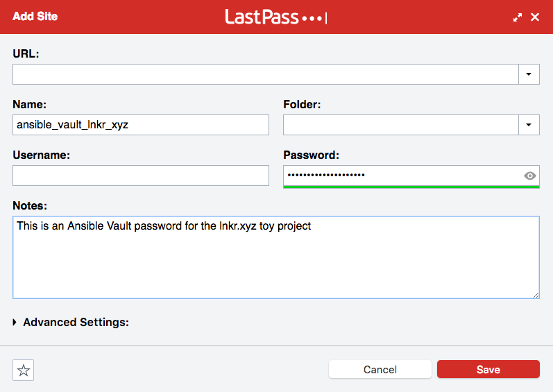

# Unlock Ansible Vault with LastPass

Script `lastpass-ansible` in this project will let you unlock [Ansible
Vault][] with the password stored in [LastPass][].  This way you can keep
your Ansible Vault passwords along with your other secrets in LastPass, and
not worry about forgetting your passwords less.  You can use LastPass strong
password generator for your Ansible Vault too.

# How to use?

Install the tool in the terminal:

	gem install lastpass-ansible

To use it:

1. Generate a password in Ansible by adding a new site or secure note
2. Give it a name and save it.
3. Put the name of this site in `.lastpass-ansible.conf`

**Example**

Let's create a "site" with a separate password:

In the top directory of your project:

	$ pwd
	/Users/wk/r/lnkr_xyz

You'd do:

	echo ansible_vault_lnkr_xyz > .lastpass-ansible.conf
	git add .lastpass-ansible.conf
	git commit -m "Add lastpass-ansible config to the project" .lastpass-ansible.conf

[Ansible Vault]: http://docs.ansible.com/ansible/playbooks_vault.html
[LastPass]: https://www.lastpass.com

## Author

- Wojciech Adam Koszek, [wojciech@koszek.com](mailto:wojciech@koszek.com)
- [http://www.koszek.com](http://www.koszek.com)
